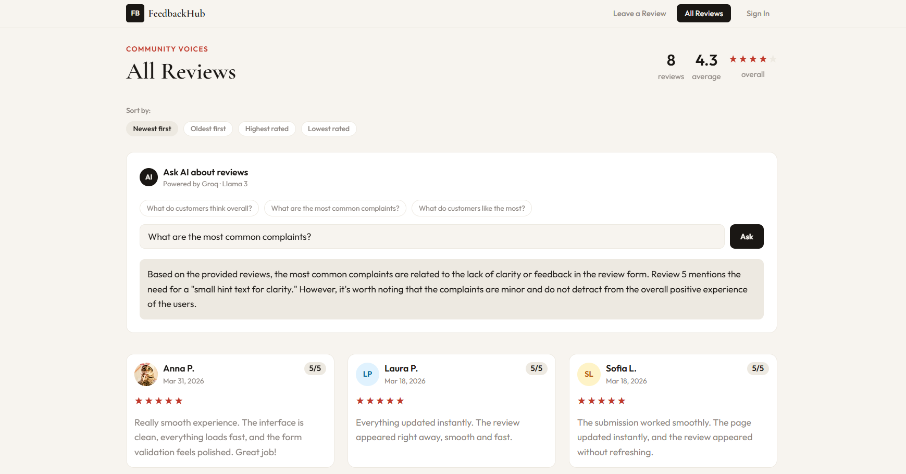
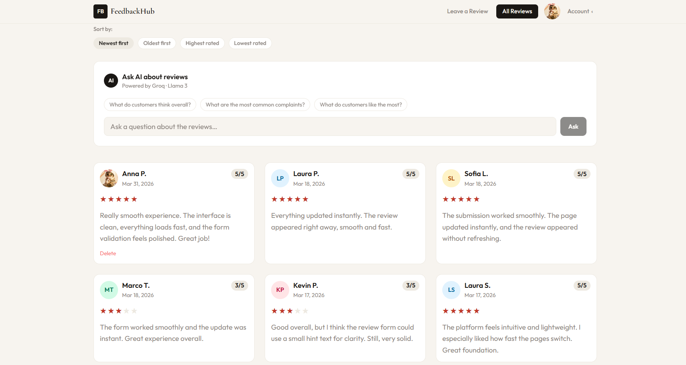
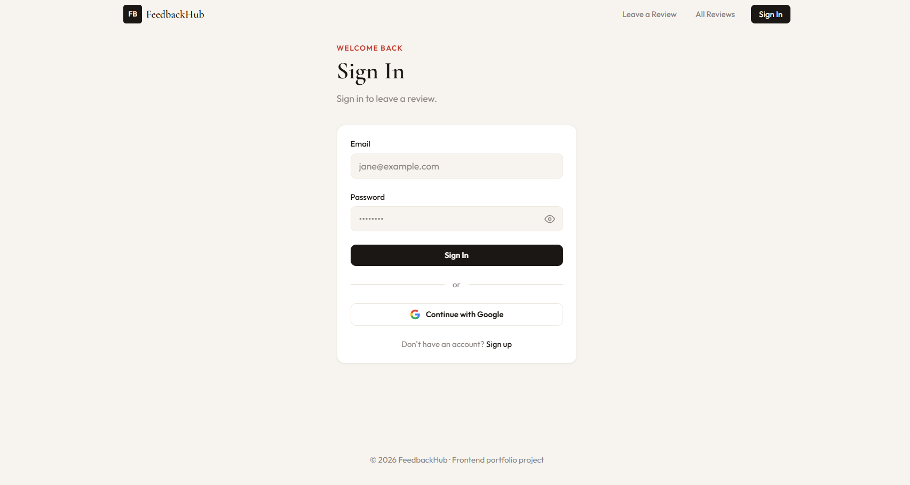
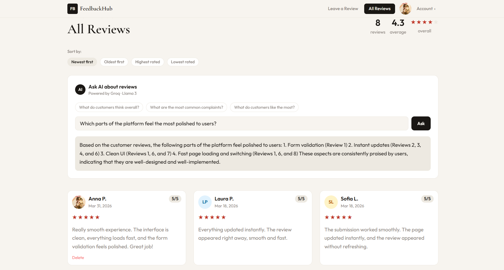
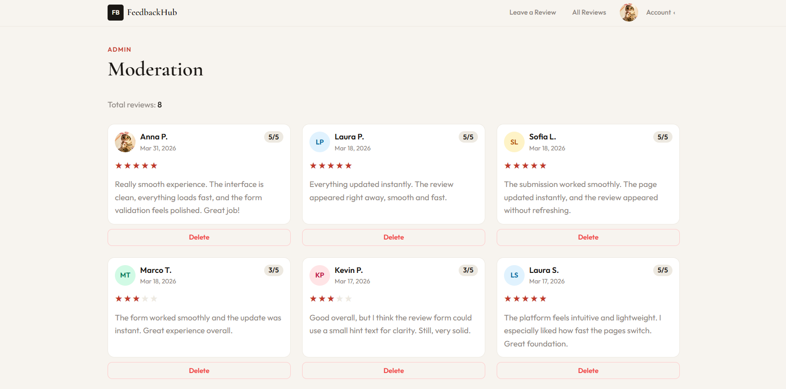
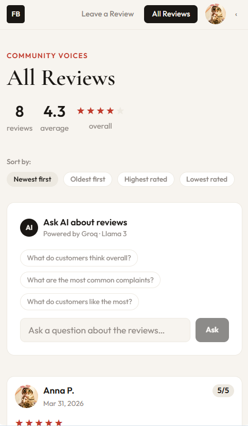
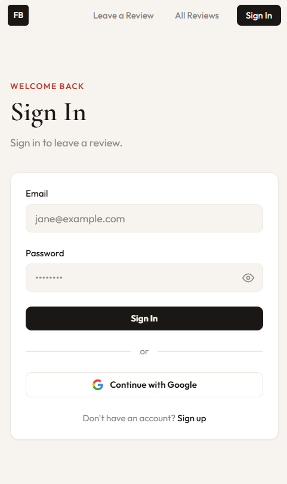

# FeedbackHub — Modern Feedback Platform

A clean, modern feedback platform built with React, Vite, Tailwind CSS and Supabase.  
Users can submit reviews, browse community feedback, sort by rating or date, and explore AI‑powered insights.  
Designed as a polished, production‑ready mini‑SaaS to demonstrate full‑stack development and real UX quality.



---

## 🌟 Features

- Submit feedback with validation (name, message, rating, category)
- Custom category selector and character counter
- Public feedback wall with sorting (newest, oldest, highest, lowest)
- Summary stats: total reviews + average rating
- AI‑powered review analysis (Groq + Llama 3)
- Authentication: email/password + Google OAuth
- Avatar upload with hover effect and fallback initials
- Admin panel for moderation
- Realtime updates via Supabase channels
- Skeleton loaders, toast notifications, staggered animations
- Responsive layout (1 → 2 → 3 columns)
- Clean typography, custom favicon, polished UI details

---

## 🔥 Recent Improvements (2026)

### **UX & UI Enhancements**

- Smooth delete UX (no flash, single toast)
- Improved login error state and success UI
- Updated WallPage sorting block
- Improved active navigation states
- Removed focus outlines
- Updated WallPage styling and spacing
- Added custom favicon (SVG + PNG)

### **Stability & Realtime**

- Fixed empty‑state flicker after inactivity
- Silent refetch no longer overwrites data
- Added realtime reconnect handler
- Normalized timestamps to UTC before saving

### **Responsive Design**

- Full 320px mobile adaptation (v4)
- 375–430px adaptation (v3)
- Updated layout transitions and grid behavior

### **General**

- Updated footer year to 2026
- Extended documentation and project structure
- Added CHANGELOG.md

---

## 📸 Screenshots

### **Main Experience**

| Wall Page                   | Submit Form                   |
| --------------------------- | ----------------------------- |
|  |  |

### **AI Features**

| Ask AI — Chat Widget      |
| ------------------------- |
|  |

### **Admin Tools**

| Moderation Panel             |
| ---------------------------- |
|  |

### **Mobile Layout**

| Mobile — Wall                      | Mobile — Submit                      |
| ---------------------------------- | ------------------------------------ |
|  |  |

---

## 🛠 Tech Stack

**Frontend:** React 18, Vite, Tailwind CSS  
**Backend:** Supabase (Auth, DB, Realtime, Storage, Edge Functions)  
**AI:** Groq (Llama 3)  
**Email:** Resend  
**Auth:** Google OAuth  
**Fonts:** Cormorant Garamond, Outfit

---

## 📂 Project Structure

```text
src/
├── App.jsx
├── main.jsx
├── supabaseClient.js
├── hooks/
│   ├── useFeedback.js
│   └── useProfile.js
├── components/
│   ├── Navbar.jsx
│   ├── FeedbackCard.jsx
│   ├── StarRating.jsx
│   ├── CategorySelect.jsx
│   ├── AvatarUpload.jsx
│   └── AskAI.jsx
└── pages/
    ├── SubmitPage.jsx
    ├── WallPage.jsx
    ├── LoginPage.jsx
    ├── RegisterPage.jsx
    └── AdminPage.jsx
```

---

## Getting Started

npm install
cp .env.example .env
npm run dev

---

## 📘 Documentation

Full SQL schema, RLS policies, and integration details are available in:

CLAUDE.md — technical documentation for developers.

---

## 📬 Contact

**Anna Pleshakova — Frontend Developer & Vibe Coder**
Email: ann.pleshakova@gmail.com
Portfolio: (coming soon)
Currently building a clean, scalable portfolio experience.
